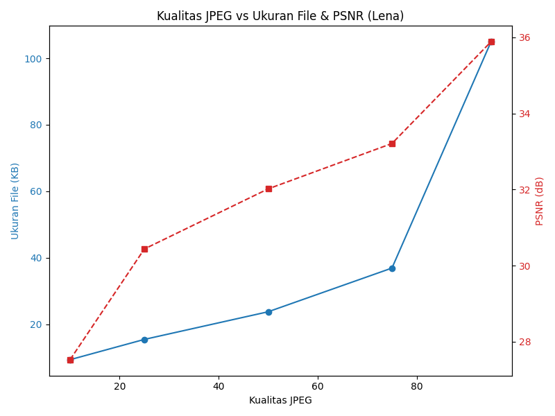
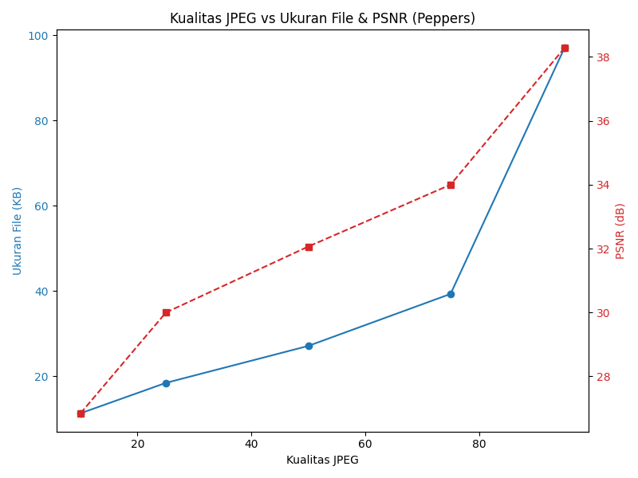
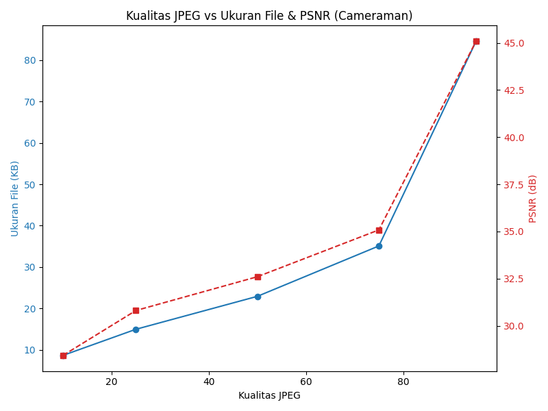
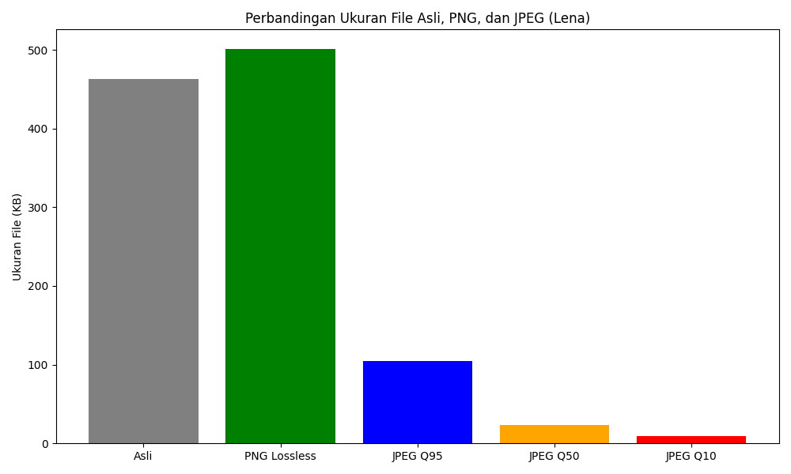
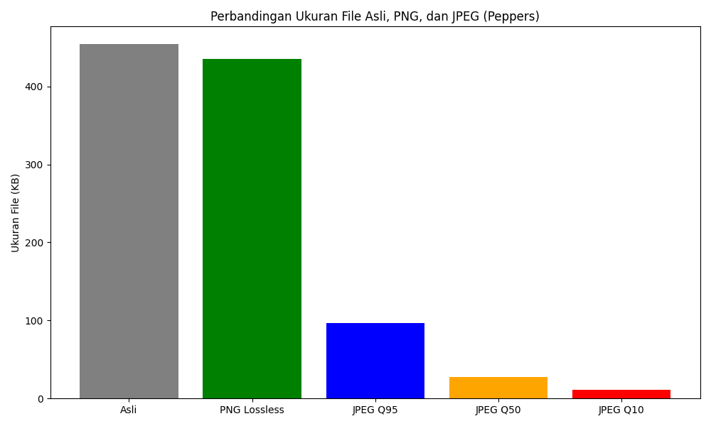
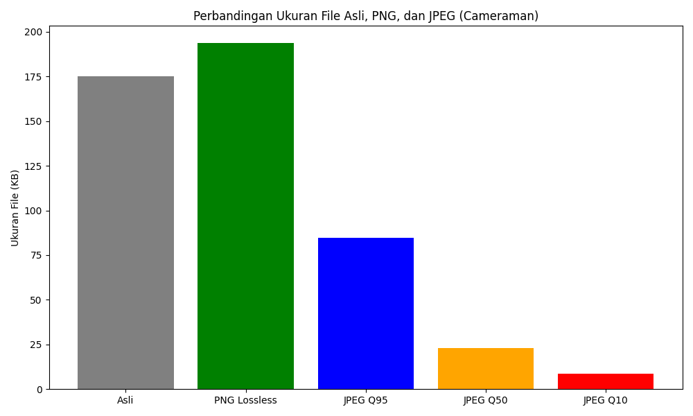

# Modul 6: Pengolahan Citra Digital - Kompresi Citra (Lossy dan Lossless)

**Nama**: Ersya Hasby Satria  
**NIM**: 072  
**Tanggal**: 07/05/2026  
**Kelas**: 2C D3 PCD 2024  

## 1. Hasil Eksperimen

Berikut adalah tabel hasil kompresi dari 3 citra input (Lena, Peppers, dan Cameraman) dengan berbagai metode dan parameter kompresi.

| Citra Input | Metode Kompresi | Kualitas/Level | Ukuran File (KB) | Rasio Kompresi | PSNR (dB) | SSIM | Identik? |
| :--- | :--- | :--- | :--- | :--- | :--- | :--- | :--- |
| Lena | Asli | - | 462.72 | 1.000 | Infinity | 1.0000 | Ya |
| Lena | JPEG | 95 | 104.95 | 4.408 | 35.88 | 0.9105 | Tidak |
| Lena | JPEG | 75 | 36.90 | 12.539 | 33.20 | 0.8665 | Tidak |
| Lena | JPEG | 50 | 23.75 | 19.475 | 32.01 | 0.8428 | Tidak |
| Lena | JPEG | 25 | 15.44 | 29.960 | 30.43 | 0.8064 | Tidak |
| Lena | JPEG | 10 | 9.34 | 49.532 | 27.52 | 0.7321 | Tidak |
| Lena | PNG | Lossless | 500.79 | 0.923 | Infinity | 1.0000 | Ya |
| Peppers | Asli | - | 454.01 | 1.000 | Infinity | 1.0000 | Ya |
| Peppers | JPEG | 95 | 96.98 | 4.681 | 38.28 | 0.9700 | Tidak |
| Peppers | JPEG | 75 | 39.29 | 11.553 | 34.00 | 0.9405 | Tidak |
| Peppers | JPEG | 50 | 27.09 | 16.754 | 32.06 | 0.9202 | Tidak |
| Peppers | JPEG | 25 | 18.43 | 24.629 | 29.99 | 0.8889 | Tidak |
| Peppers | JPEG | 10 | 11.29 | 40.203 | 26.84 | 0.8119 | Tidak |
| Peppers | PNG | Lossless | 434.98 | 1.043 | Infinity | 1.0000 | Ya |
| Cameraman | Asli | - | 174.97 | 1.000 | Infinity | 1.0000 | Ya |
| Cameraman | JPEG | 95 | 84.58 | 2.068 | 45.08 | 0.9904 | Tidak |
| Cameraman | JPEG | 75 | 35.09 | 4.986 | 35.08 | 0.9485 | Tidak |
| Cameraman | JPEG | 50 | 22.91 | 7.635 | 32.59 | 0.9141 | Tidak |
| Cameraman | JPEG | 25 | 14.95 | 11.704 | 30.80 | 0.8722 | Tidak |
| Cameraman | JPEG | 10 | 8.63 | 20.259 | 28.42 | 0.7844 | Tidak |
| Cameraman | PNG | Lossless | 193.57 | 0.903 | Infinity | 1.0000 | Ya |

## 2. Grafik Perbandingan

### Grafik Kualitas JPEG vs Ukuran File & PSNR

### Grafik Perbandingan Ukuran File

## 3. Pembahasan Trade-off Tingkat Kompresi vs Kualitas (JPEG)
Dari hasil eksperimen, terlihat trade-off yang jelas antara ukuran file dan kualitas gambar:
- **Penurunan Ukuran**: Saat tingkat kualitas (parameter `quality`) diturunkan dari 95 ke 10, ukuran file menurun secara drastis (contohnya Lena JPEG Q95 berukuran ~104 KB turun menjadi ~9 KB pada Q10).
- **Penurunan Kualitas**: Namun, hal tersebut diikuti dengan degradasi kualitas gambar (PSNR dan SSIM yang makin mengecil). Pada kualitas Q10, citra memperlihatkan artefak *blocking* secara jelas, akibat metode kuantisasi pada proses DCT yang membuang data frekuensi tinggi dalam blok 8x8.
- Kualitas *sweet-spot* biasanya berada di rentang 75-85, di mana penurunan metrik (PSNR dan SSIM) belum dapat dibedakan mata telanjang (HVS), tetapi pengurangan memori telah tercapai hingga 5x-10x.

## 4. Perbandingan Lossy (JPEG) vs Lossless (PNG)
- **Kualitas**: PNG selalu berhasil mempertahankan representasi bit-perfect (SSIM = 1.0, PSNR = Infinity), sedangkan JPEG menghilangkan beberapa spektral data di setiap tingkatannya.
- **Rasio Kompresi**: JPEG jauh lebih efisien pada tipe citra fotografi kompleks dibandingkan PNG. PNG hanya memberikan rasio kompresi sekitar ~1.0x (bahkan ada yang menghasilkan file lebih besar dibandingkan ukuran aslinya yang mungkin sudah terkompresi optimal). JPEG mampu melampaui rasio kompresi tinggi mencapai >20x.
- **Kapan Digunakan?**: Gunakan JPEG untuk gambar-gambar nyata, foto, atau ketika memori dan *bandwidth* terbatas. Gunakan PNG apabila detail absolut (pixel-perfect) dibutuhkan (misalnya di bidang pencitraan medis, ikon grafis, teks, atau saat gambar akan mengalami *editing* berulang-ulang tanpa mau mengalami degradasi *lossy*).

## 5. Relevansi di Dunia Nyata
- **Penyimpanan Arsip Foto Pribadi**: JPEG dengan Kualitas 80-95 sangat optimal untuk menyimpan arsip memori foto tanpa menghabiskan *hard disk*.
- **Pengiriman Gambar via Chat (WhatsApp, dsb)**: Aplikasi pengirim pesan menerapkan kompresi *Lossy* ekstrem (JPEG Q50-Q70 dan resolusi yang diperkecil) demi mempercepat transmisi dan menghemat bandwidth. 
- **Gambar Ikon di Website**: PNG adalah standar mutlak karena *Lossless* menjaga tepian vektor, bentuk geometris, serta mendukung *alpha channel* (transparansi).
- **Citra Medis (MRI, CT Scan)**: WAJIB menggunakan kompresi *Lossless* (PNG / lossless TIFF / DICOM) karena artefak kecil sekecil apapun di dalam *Lossy* dapat berdampak fatal dalam mendiagnosis penyakit pasien.

## 6. Mengapa pada Eksperimen 2, Kasus Lena, Rationya < 1 (Ukuran File Terkompresi > File Asli)?
Hal tersebut terjadi karena file asli `lena.png` yang kita jadikan rujukan telah terkompresi secara optimal menggunakan *encoder* spesifik (misalnya menggunakan *filter-heuristics* mutakhir atau algoritma seperti `optipng`). Ketika OpenCV (dengan pustaka `libpng` default) memuat *array* *bitmap* uncompressed di *memory* lalu menyimpannya ulang (*encode*) sebagai PNG dengan konfigurasi kompresi standard OpenCV, proses optimasinya tidak seefisien saat awal *encoder* file aslinya dibuat. Terlebih lagi, PNG seringkali menyimpan *overhead chunk headers* yang membuatnya membengkak apabila disetel di parameter yang kurang agresif, menyebabkan ukuran yang disave ulang menjadi sedikit lebih besar daripada aslinya.

## 7. Kesimpulan
1. Kompresi **Lossy** (JPEG) membuang informasi detail secara *irreversible* namun memberikan pemangkasan ukuran file yang ekstrem.
2. Kompresi **Lossless** (PNG) menjaga integritas *pixel* pada metrik kuantitatif (*PSNR = Inf*, *SSIM = 1.0*), namun ukuran datanya tak akan sekecil JPEG dan sangat bergantung pada entropi gambar.
3. Menurunkan kualitas JPEG tidak memangkas metrik PSNR dan ukuran file secara linier.
4. Parameter JPEG merupakan alat kontrol yang optimal untuk menyeimbangkan batasan penyimpanan dan batasan toleransi *Human Visual System* sesuai *use case* program masing-masing.

---
### Code Repository
Kode program yang diimplementasikan pada praktikum ini terdapat di: `run_experiments.py`.
